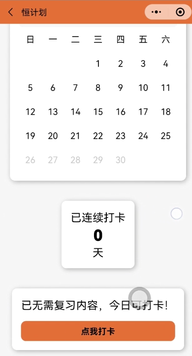

## 仓库简介

本小程序《恒计划》（EterPlan）是本人大一时期课程作业，现在大三才想起来这个东西还挺有价值的，故上传到github开源。

## 使用方法

app.js中需要把参数修改为你的云开发环境应有的参数。本小程序需要部署云开发服务器数据库才能正常使用。部署好之后注册账号就可以了。

需要自己在数据库中上传数据，由于这个程序太久远了，云开发服务器没有续费，数据已经遗失，如需测试可能需要自己重新上传。uploadCloudFunction.bat也删了，需要重新生成。

## 软件简介

随着中高考、考研等考试的竞争越来越激烈，人们对学习类软件的需求也越来越大。

而 app/小程序能在手机上打开，让人们充分利用碎片时间进行学习，如食堂排队时、乘坐交通工具时、下课时间等。小程序更是简单快捷，不需要安装就可以进行学习。

市面上有不少同类 app/小程序，但最流行、最完善是英语类，如《扇贝单词》、《百词斩》、《不背单词》，英语科的此类 app/小程序可以说是达到了同类的顶峰。

而其它学科，如语文、思政、法学等同样需要大量记忆的科目，虽有 app/小程序如《记乎》、《惊叹记忆卡》、《马克思带背》等，但 app《记乎》商业化严重，界面令人眼花缭乱，内容繁杂且多收费内容，且无方便快捷的小程序版本；而 app《惊叹记忆卡》则需要自己导入学习资源，比较麻烦，提高了学习者的时间成本；小程序《马克思带背》简单快捷，但无完善的背诵机制；这些科目其它的 app/小程序也是大多没有完善的智能推送学习计划的机制。

总而言之，英语外的同样有大量记忆需求的科目的相关学习 app/小程序发展仍很不完善，供跟不上需。

而且这些 app/小程序大多有一个缺点，就是复习内容推送机制固定，无法让用户根据自己的复习需求定制复习间隔。

于是本小程序《恒计划》横空出世啦！

## 功能介绍
《恒计划》结合艾宾浩斯遗忘曲线，设计算法，智能生成复习计划。

对于每个章节，先新学习第一次掌握，掌握之后，等待一段时间（比如几个小时或一两天，久的几十天或一年都不一定推送，因用户设置的额定记忆率和本章节复习次数而异），便会在复习计划中推送该章节供用户复习。

根据每个人记忆能力和知识难度不同，用户可以自己设置“额定记忆率”，来产生不同频率的智能复习推送。

《恒计划》云开发数据库中存放了语文、思政、法学等基础性的学习、背诵资源，将请相关专业人士不断更新导入，满足使用者需求。

我们还有打卡功能，当目前没有未复习内容，则可打今日的卡，方便使用者督促自己学习。

同时本小程序也支持夜间模式。

## 运用技术

利用艾宾浩斯遗忘曲线和用户设置的记忆率，根据一个章节的背诵时间，使用设计好的算法智能生成背诵计划推送给用户。

利用微信云开发中的数据库和云函数存储了知识内容和用户数据，从服务器下载知识内容以防止小程序体积超限和使更新内容更便捷，同时防止用户数据丢失，另外学习时间也从服务器获取，避免了从本地获取时间而产生的误差。

同时，对于将知识资源导入数据库，我们在电脑另外编写了方便不熟悉 JSON 和数据库的人导入知识资源的软件，不包含在小程序内。

## 截图演示

更具体的可以查看根目录中的视频[video.mp4](video.mp4)。

## 开原许可证

使用本仓库源码时请遵守[MIT License](LICENSE)。
